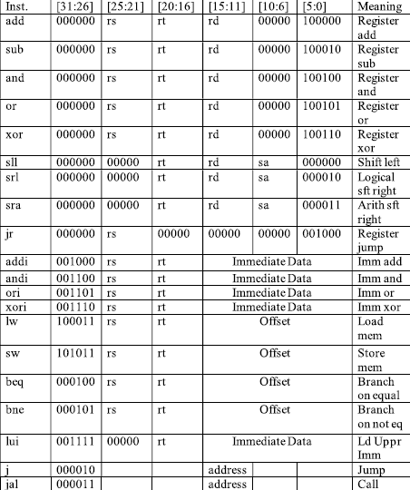

# High Performance Computing Processor

### Table of Contents

1. [Team & Mentor](#t&m)
2. [Introduction](#introduction)
      1. [History](#mips_his)
      2. [Targeted ISA](#ISA)
3. [Processor Specifications](#spec)
4. [Simulation](#sim)
5. [Implementation](#impl)
6. [Reports](#rpts)
     1. [Power](#pwr)
     2. [Area](#area)
     3. [Timing](#tim)
7. [Analysis](#ana)
8. [Applications](#app)
9. [Conclusion](#conc)

### Team & Mentor 

<b>Mentor : Assoc Prof P. Anil Kumar </b>

<b> Team : D12 - ECE-D </b>

| Name                  | Roll Number |
| --------------------- | ----------- |
| Srimanth Tenneti      | 18B81A04N6  |
| Pavan Kumar           | 18B81A04L8  |
| Rithvik Reddy         | 18B81A04M3  |

### Introduction
#### History 

MIPS (Microprocessor without Interlocked Pipelined Stages) is a family of reduced instruction set computer (RISC) instruction set architectures developed by MIPS Computer Systems, now MIPS Technologies, based in the United States.

There are multiple versions of MIPS: including MIPS I, II, III, IV, and V; as well as five releases of MIPS32/64 (for 32- and 64-bit implementations, respectively). The early MIPS architectures were 32-bit; 64-bit versions were developed later. As of April 2017, the current version of MIPS is MIPS32/64 Release 6. MIPS32/64 primarily differs from MIPS I–V by defining the privileged kernel mode System Control Coprocessor in addition to the user mode architecture.

#### Targeted ISA 
##### Integer Core - v1.01

The following MIPS32 instructions are supported by our Integer Core v1.01. 

### Processor Specifications 

| Parameter                   | Information        |
| --------------------------- | ------------------ |
| ISA                         | MIPS32             |
| Family                      | M32HAIAF           |
| Model                       | 0002(Latest)       |
| Architecture                | Harvard Model      |
| GPRs                        | 32                 |
| Flags                       | Overflow,Zero,Halt |
| Supported Instruction Types | R,I,J Types        |
| External Interrupts         |  1                 |
| FPU Supported Operations    | Add,Sub,Mul,Div    |
| Pipelined                   | Yes                |
| I/O Interfaces              | UART,PS-II,I2C     |
| Bus Interface               | AXI | PCI (NYD)    | 

