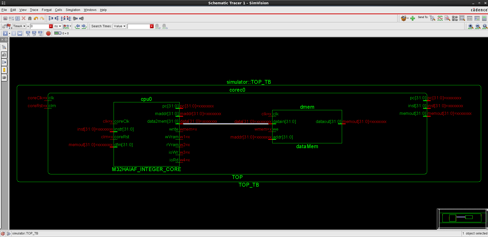
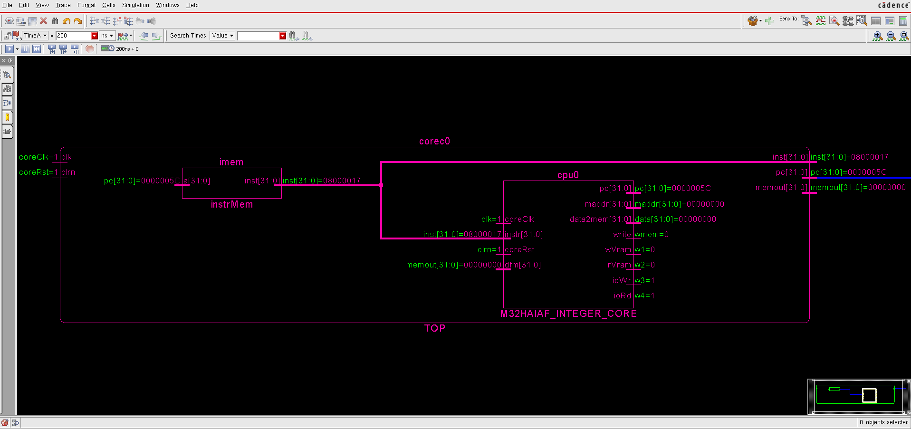
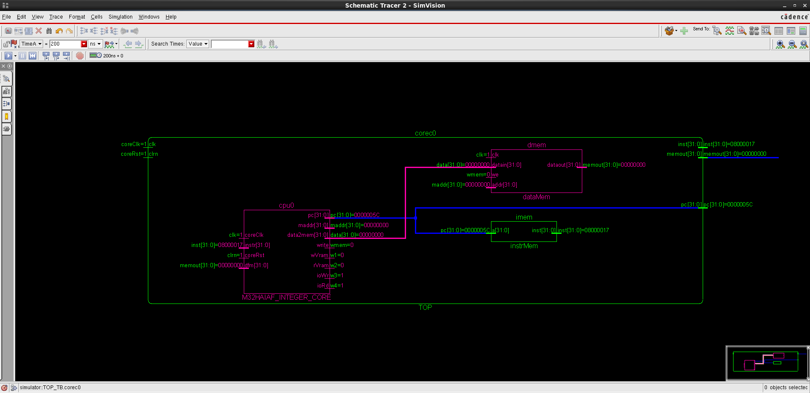

# M32HAIAF INTEGER CORE - Rev0003

### Introduction

This Integer IP core is a stable version of the M32HAIAF family processors. This supports upto 20 basic MIPS32 instructions. 

### Results

#### Simulation 

### Data Memory to M32HAIAF Core Interface

### Instruction Memory to M32HAIAF Core Interface

### Top Level Architecture

